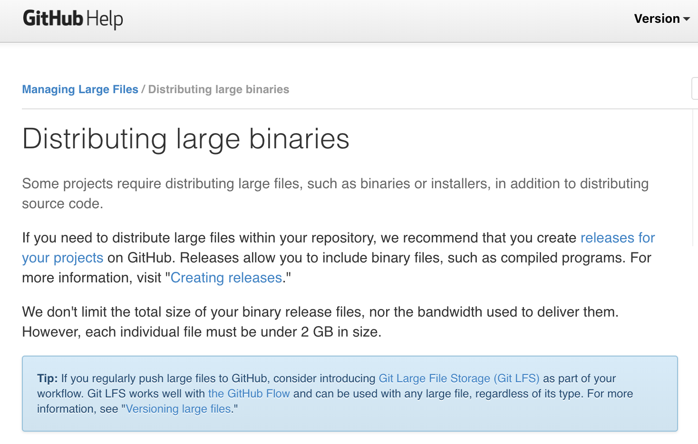

<!-- README.md is generated from README.Rmd. Please edit that file -->

# piggyback 

[](https://www.tidyverse.org/lifecycle/#stable)
[](https://travis-ci.org/ropensci/piggyback)
[](https://codecov.io/github/ropensci/piggyback?branch=master)
[](https://ci.appveyor.com/project/cboettig/piggyback)
[](https://cran.r-project.org/package=piggyback)
[](https://github.com/ropensci/onboarding/issues/220)
[](https://zenodo.org/badge/latestdoi/132979724)
[](https://doi.org/10.21105/joss.00971)

Because larger (\> 50 MB) data files cannot easily be committed to git,
a different approach is required to manage data associated with an
analysis in a GitHub repository. This package provides a simple
work-around by allowing larger ([up to 2 GB per
file](https://help.github.com/articles/distributing-large-binaries/))
data files to piggyback on a repository as assets attached to individual
GitHub releases. These files are not handled by git in any way, but
instead are uploaded, downloaded, or edited directly by calls through
the GitHub API. These data files can be versioned manually by creating
different releases. This approach works equally well with public or
private repositories. Data can be uploaded and downloaded
programmatically from scripts. No authentication is required to download
data from public repositories.

## Installation

Install from CRAN via

``` r
install.packages("piggyback")
```

You can install the development version from
[GitHub](https://github.com/) with:

``` r
# install.packages("devtools")
devtools::install_github("ropensci/piggyback")
```

## Quickstart

See the [piggyback
vignette](https://docs.ropensci.org/piggyback/articles/intro.html) for
details on authentication and additional package functionality.

Piggyback can download data attached to a release on any repository:

``` r
library(piggyback)
pb_download("data/mtcars.tsv.gz", repo = "cboettig/piggyback-tests", dest = tempdir())
```

Downloading from private repos or uploading to any repo requires
authentication, so be sure to set a `GITHUB_TOKEN` (or `GITHUB_PAT`)
environmental variable, or include the `.token` argument. Omit the file
name to download all attached objects. Omit the repository name to
default to the current repository. See [introductory
vignette](https://docs.ropensci.org/piggyback/articles/intro.html) or
function documentation for details.

We can also upload data to any existing release (defaults to `latest`):

``` r
## We'll need some example data first.
## Pro tip: compress your tabular data to save space & speed upload/downloads
readr::write_tsv(mtcars, "mtcars.tsv.gz")

pb_upload("mtcars.tsv.gz", repo = "cboettig/piggyback-tests")
```

### Tracking data files

For a [Git LFS](https://git-lfs.github.com/) style workflow, just
specify the type of files you wish to track using `pb_track()`.
Piggyback will retain a record of these files in a hidden
`.pbattributes` file in your repository, and add these to `.gitignore`
so you don’t accidentally commit them to GitHub. `pb_track` will also
return a list of such files that you can easily pass to `pb_upload()`:

``` r
# track csv files, compressed data, and geotiff files:
pb_track(c("*.csv", "*.gz", "*.tif")) %>%
pb_upload()
```

You can easily download the latest version of all data attached to a
given release with `pb_download()` with no file argument (analogous to a
`git pull` for data):

``` r
pb_download()
```

## Git LFS and other alternatives

`piggyback` acts like a poor soul’s [Git
LFS](https://git-lfs.github.com/). Git LFS is not only expensive, it
also [breaks GitHub’s collaborative
model](https://medium.com/@megastep/github-s-large-file-storage-is-no-panacea-for-open-source-quite-the-opposite-12c0e16a9a91)
– basically if someone wants to submit a PR with a simple edit to your
docs, they cannot fork your repository since that would otherwise count
against your Git LFS storage. Unlike Git LFS, `piggyback` doesn’t take
over your standard `git` client, it just perches comfortably on the
shoulders of your existing GitHub API. Data can be versioned by
`piggyback`, but relative to `git LFS` versioning is less strict:
uploads can be set as a new version or allowed to overwrite previously
uploaded data.

## But what will GitHub think of this?

[GitHub
documentation](https://help.github.com/articles/distributing-large-binaries/)
at the time of writing endorses the use of attachments to releases as a
solution for distributing large files as part of your project:



Of course, it will be up to GitHub to decide if this use of release
attachments is acceptable in the long term.

<!--
 When GitHub first came online, it was questioned whether committing binary objects and data to GitHub was acceptable or an abuse of a *source code* repository.  GitHub has since clearly embraced a inclusive notion of "repository" for containing far more than pure source.  I believe attaching data that is essential to replicating an analysis and within the 2 GB file limits enforced by GitHub to be in the same spirit of this inclusive notion, but GitHub may decide otherwise. 
 -->

Also see our [vignette comparing
alternatives](https://docs.ropensci.org/piggyback/articles/alternatives.html).

-----

Please note that this project is released with a [Contributor Code of
Conduct](https://ropensci.org/code-of-conduct/). By participating in
this project you agree to abide by its
terms.

[](https://ropensci.org)
